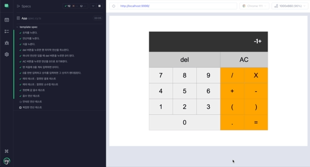

# 계산기 v2.0



[과거에 진행했던 계산기 앱](https://github.com/ryong9rrr/calculator-v1.0)을 다시 구현합니다.

- [x] **바닐라 타입스크립트**로 직접 구현한, 컴포넌트 기반의 UI 프레임워크를 이용해서 다시 구현합니다.

- [x] jest를 이용해서 비지니스 로직을 테스트 해봅니다.

- [x] cypress를 이용해서 E2E 테스트를 해봅니다.

## 실행 방법

이 저장소를 클론하고 의존성 모듈을 설치해주세요.

```
1. git clone ...

2. yarn install
```

- 계산기 알고리즘(비지니스 로직) 테스트 : `yarn test`

- 개발 환경 구동(웹팩) : `yarn dev`

- 프로덕션용 빌드 : `yarn build`

### cypress 실행방법

1. 터미널을 열어서 `yarn dev` 명령어로 개발 환경을 구동해주세요.

2. 다른 터미널을 연 뒤, `yarn test:cypress` 명령어로 cypress E2E 테스트를 실행할 수 있어요.
